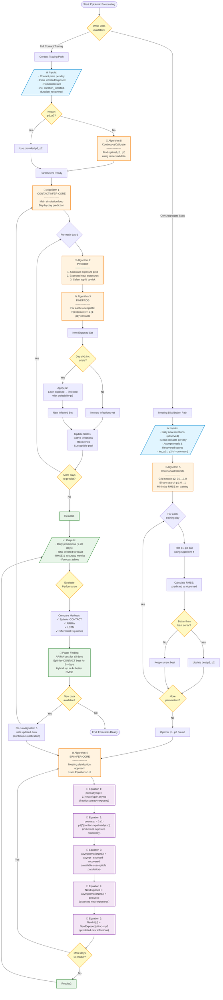
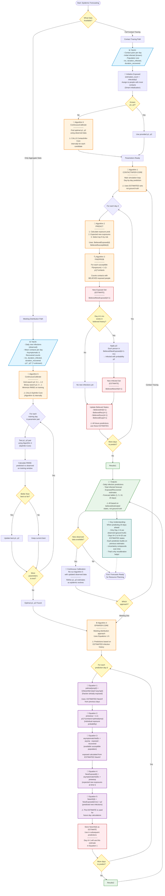

```mermaid
graph TB
    Start([Start: Epidemic Forecasting]) --> InputCheck{What Data<br/>Available?}
    
    InputCheck -->|Full Contact Tracing| ContactPath[Contact Tracing Path]
    InputCheck -->|Only Aggregate Stats| DistPath[Meeting Distribution Path]
    
    %% Contact Tracing Path
    ContactPath --> Input1[/"📊 Inputs:<br/>- Contact pairs per day<br/>- Initial infected/exposed<br/>- Population size<br/>- inc, duration_infected, duration_recovered"/]
    
    Input1 --> Calibrate1{Known<br/>p1, p2?}
    Calibrate1 -->|No| Alg5a["🔧 Algorithm 5<br/>ContinuousCalibrate<br/>-----------------<br/>Find optimal p1, p2<br/>using observed data"]
    Calibrate1 -->|Yes| UseParams1[Use provided p1, p2]
    Alg5a --> GotParams1[Parameters Ready]
    UseParams1 --> GotParams1
    
    GotParams1 --> Alg1["🎯 Algorithm 1<br/>CONTACTINFER-CORE<br/>-----------------<br/>Main simulation loop<br/>Day-by-day prediction"]
    
    Alg1 --> DayLoop1{For each day d}
    
    DayLoop1 --> Alg2["📍 Algorithm 2<br/>PREDICT<br/>-----------------<br/>1. Calculate exposure prob<br/>2. Expected new exposures<br/>3. Select top N by risk"]
    
    Alg2 --> Alg3["🔍 Algorithm 3<br/>FINDPROB<br/>-----------------<br/>For each susceptible:<br/>P(exposure) = 1-(1-p1)^contacts"]
    
    Alg3 --> NewExp[New Exposed Set]
    NewExp --> CheckInf{Day d+1-inc<br/>exists?}
    
    CheckInf -->|Yes| ApplyP2["Apply p2:<br/>Each exposed → infected<br/>with probability p2"]
    CheckInf -->|No| Skip1[No new infections yet]
    
    ApplyP2 --> NewInf1[New Infected Set]
    Skip1 --> UpdateStates1
    NewInf1 --> UpdateStates1["Update States:<br/>- Active infections<br/>- Recoveries<br/>- Susceptible pool"]
    
    UpdateStates1 --> MoreDays1{More days<br/>to predict?}
    MoreDays1 -->|Yes| DayLoop1
    MoreDays1 -->|No| Results1
    
    %% Meeting Distribution Path
    DistPath --> Input2[/"📊 Inputs:<br/>- Daily new infections (observed)<br/>- Mean contacts per day<br/>- Asymptomatic & Recovered counts<br/>- inc, p1*, p2* (*=unknown)"/]
    
    Input2 --> Alg5b["🔧 Algorithm 5<br/>ContinuousCalibrate<br/>-----------------<br/>Grid search p2: 0.1→1.0<br/>Binary search p1: 0→1<br/>Minimize RMSE on training"]
    
    Alg5b --> TrainLoop{For each<br/>training day}
    
    TrainLoop --> TestParams["Test p1, p2 pair<br/>using Algorithm 4"]
    TestParams --> CalcRMSE["Calculate RMSE:<br/>predicted vs observed"]
    CalcRMSE --> BestParams{Better than<br/>best so far?}
    BestParams -->|Yes| UpdateBest[Update best p1, p2]
    BestParams -->|No| KeepBest[Keep current best]
    UpdateBest --> MoreTests{More<br/>parameters?}
    KeepBest --> MoreTests
    MoreTests -->|Yes| TrainLoop
    MoreTests -->|No| GotParams2[Optimal p1, p2 Found]
    
    GotParams2 --> Alg4["⚙️ Algorithm 4<br/>EPIINFER-CORE<br/>-----------------<br/>Meeting distribution approach<br/>Uses Equations 1-5"]
    
    Alg4 --> Eq1["📐 Equation 1:<br/>palreadyexp = Σ(NewInf)/p2×asymp<br/>(fraction already exposed)"]
    
    Eq1 --> Eq2["📐 Equation 2:<br/>pnewexp = 1-(1-p1)^(contacts×palreadyexp)<br/>(individual exposure probability)"]
    
    Eq2 --> Eq3["📐 Equation 3:<br/>asymptomaticNotEx = asymp - exposed - recovered<br/>(available susceptible population)"]
    
    Eq3 --> Eq4["📐 Equation 4:<br/>NewExposed = asymptomaticNotEx × pnewexp<br/>(expected new exposures)"]
    
    Eq4 --> Eq5["📐 Equation 5:<br/>NewInf(d) = NewExposed(d-inc) × p2<br/>(predicted new infections)"]
    
    Eq5 --> MoreDays2{More days<br/>to predict?}
    MoreDays2 -->|Yes| Alg4
    MoreDays2 -->|No| Results2
    
    %% Results
    Results1 --> Output[/"📈 Outputs:<br/>- Daily predictions (1-20 days)<br/>- Total infected forecast<br/>- RMSE & accuracy metrics<br/>- Forecast tables"/]
    Results2 --> Output
    
    Output --> Evaluate{Evaluate<br/>Performance}
    
    Evaluate --> Compare["Compare Methods:<br/>✓ EpiInfer-CONTACT<br/>✓ ARIMA<br/>✓ LSTM<br/>✓ Differential Equations"]
    
    Compare --> Insight["📌 Paper Finding:<br/>ARIMA best for ≤5 days<br/>EpiInfer-CONTACT best for 6+ days<br/>Hybrid: up to 4× better RMSE"]
    
    Insight --> Update{New data<br/>available?}
    
    Update -->|Yes| Recalibrate["Re-run Algorithm 5<br/>with updated data<br/>(continuous calibration)"]
    Recalibrate --> Alg1
    Recalibrate --> Alg4
    Update -->|No| End([End: Forecasts Ready])
    
    %% Styling
    classDef inputStyle fill:#e1f5ff,stroke:#0288d1,stroke-width:2px
    classDef algoStyle fill:#fff3e0,stroke:#f57c00,stroke-width:2px
    classDef eqStyle fill:#f3e5f5,stroke:#7b1fa2,stroke-width:2px
    classDef outputStyle fill:#e8f5e9,stroke:#388e3c,stroke-width:2px
    classDef decisionStyle fill:#fff9c4,stroke:#f9a825,stroke-width:2px
    
    class Input1,Input2 inputStyle
    class Alg1,Alg2,Alg3,Alg4,Alg5a,Alg5b algoStyle
    class Eq1,Eq2,Eq3,Eq4,Eq5 eqStyle
    class Output,Results1,Results2,Insight outputStyle
    class InputCheck,Calibrate1,CheckInf,MoreDays1,MoreDays2,BestParams,MoreTests,Evaluate,Update decisionStyle
```

## Flow Chart 2

```mermaid
graph TB
    Start([Start: Epidemic Forecasting]) --> InputCheck{What Data<br/>Available?}
    
    InputCheck -->|Full Contact Tracing| ContactPath[Contact Tracing Path]
    InputCheck -->|Only Aggregate Stats| DistPath[Meeting Distribution Path]
    
    %% Contact Tracing Path
    ContactPath --> Input1[/"📊 Inputs:<br/>- Contact pairs per day<br/>- Initial infected (known)<br/>- Population size<br/>- inc, duration_infected, duration_recovered"/]
    
    Input1 --> InitExposed1["🔧 Initialize Exposed:<br/>estimated_count = infected/p2<br/>Assign to people with most contacts<br/>(Smart initialization)"]
    
    InitExposed1 --> Calibrate1{Known<br/>p1, p2?}
    Calibrate1 -->|No| Alg5a["🔧 Algorithm 5<br/>ContinuousCalibrate<br/>-----------------<br/>Find optimal p1, p2<br/>using observed data<br/><br/>⚠️ CALLS ContactInfer-Core<br/>internally for each candidate"]
    Calibrate1 -->|Yes| UseParams1[Use provided p1, p2]
    Alg5a --> GotParams1[Parameters Ready]
    UseParams1 --> GotParams1
    
    GotParams1 --> Alg1["🎯 Algorithm 1<br/>CONTACTINFER-CORE<br/>-----------------<br/>Main simulation loop<br/>Day-by-day prediction<br/><br/>⚠️ Uses ESTIMATED sets<br/>not ground truth"]
    
    Alg1 --> DayLoop1{For each day d}
    
    DayLoop1 --> Alg2["📍 Algorithm 2<br/>PREDICT<br/>-----------------<br/>1. Calculate exposure prob<br/>2. Expected new exposures<br/>3. Select top N by risk<br/><br/>Uses: BelievedExposed(d)<br/>BelievedSusceptible(d)"]
    
    Alg2 --> Alg3["🔍 Algorithm 3<br/>FINDPROB<br/>-----------------<br/>For each susceptible:<br/>P(exposure) = 1-(1-p1)^contacts<br/><br/>Counts contacts with<br/>BELIEVED exposed people"]
    
    Alg3 --> NewExp["New Exposed Set<br/>(ESTIMATE)<br/>-----------------<br/>BelievedNewExposed(d+1)"]
    NewExp --> CheckInf{Day d+1-inc<br/>exists in<br/>believed history?}
    
    CheckInf -->|Yes| ApplyP2["Apply p2:<br/>Each person in<br/>BelievedNewExposed(d+1-inc)<br/>→ infected with probability p2"]
    CheckInf -->|No| Skip1[No new infections yet]
    
    ApplyP2 --> NewInf1["New Infected Set<br/>(ESTIMATE)<br/>-----------------<br/>BelievedNewInf(d+1)"]
    Skip1 --> UpdateStates1
    NewInf1 --> UpdateStates1["Update Believed States:<br/>- BelievedInf(d+1)<br/>- BelievedRec(d+1)<br/>- BelievedSusc(d+1)<br/>- BelievedExp(d+1)<br/><br/>⚠️ All future predictions<br/>use these ESTIMATES"]
    
    UpdateStates1 --> MoreDays1{More days<br/>to predict?}
    MoreDays1 -->|Yes| DayLoop1
    MoreDays1 -->|No| Results1
    
    %% Meeting Distribution Path
    DistPath --> Input2[/"📊 Inputs:<br/>- Daily new infections (observed)<br/>- Mean contacts per day<br/>- Asymptomatic & Recovered counts<br/>- inc, duration_infected, duration_recovered<br/>- p1*, p2* (*=unknown)"/]
    
    Input2 --> Alg5b["🔧 Algorithm 5<br/>ContinuousCalibrate<br/>-----------------<br/>Grid search p2: 0.1→1.0<br/>Binary search p1: 0→1<br/>Minimize RMSE on training<br/><br/>⚠️ CALLS EpiInfer-Core<br/>(Algorithm 4) internally"]
    
    Alg5b --> TrainLoop{For each<br/>training day<br/>& parameter pair}
    
    TrainLoop --> TestParams["Test p1, p2 pair<br/>using Algorithm 4<br/>(EpiInfer-Core)"]
    TestParams --> CalcRMSE["Calculate RMSE:<br/>predicted vs observed<br/>on training window"]
    CalcRMSE --> BestParams{Better than<br/>best so far?}
    BestParams -->|Yes| UpdateBest[Update best p1, p2]
    BestParams -->|No| KeepBest[Keep current best]
    UpdateBest --> MoreTests{More<br/>parameters<br/>to test?}
    KeepBest --> MoreTests
    MoreTests -->|Yes| TrainLoop
    MoreTests -->|No| GotParams2[Optimal p1, p2 Found]
    
    GotParams2 --> Alg4["⚙️ Algorithm 4<br/>EPIINFER-CORE<br/>-----------------<br/>Meeting distribution approach<br/>Uses Equations 1-5<br/><br/>⚠️ Predictions based on<br/>ESTIMATED infection history"]
    
    Alg4 --> PredLoop{For each<br/>prediction day d}
    
    PredLoop --> Eq1["📐 Equation 1:<br/>palreadyexp(t) = Σ(NewInf(d-i))/p2×asymp(t)<br/>(fraction already exposed)<br/><br/>Uses: ESTIMATED NewInf from previous days"]
    
    Eq1 --> Eq2["📐 Equation 2:<br/>pnewexp = 1-(1-p1)^(contacts×palreadyexp)<br/>(individual exposure probability)"]
    
    Eq2 --> Eq3["📐 Equation 3:<br/>asymptomaticNotEx = asymp - exposed - recovered<br/>(available susceptible population)<br/><br/>exposed calculated from ESTIMATED NewInf"]
    
    Eq3 --> Eq4["📐 Equation 4:<br/>NewExposed(t) = asymptomaticNotEx × pnewexp<br/>(expected new exposures at time t)"]
    
    Eq4 --> Eq5["📐 Equation 5:<br/>NewInf(d) = NewExposed(d-inc) × p2<br/>(predicted new infections)<br/><br/>⚠️ This ESTIMATE is used for<br/>future day calculations"]
    
    Eq5 --> UpdateEstimate["Store NewInf(d) as ESTIMATE<br/>Use in subsequent predictions<br/>-----------------<br/>Day d+1 will use this estimate<br/>in Equation 1"]
    
    UpdateEstimate --> MoreDays2{More days<br/>to predict?}
    MoreDays2 -->|Yes| PredLoop
    MoreDays2 -->|No| Results2
    
    %% Results
    Results1 --> Output[/"📈 Outputs:<br/>- Daily infection predictions<br/>- Total infected forecast<br/>- Exposed/Recovered estimates<br/>- Forecast tables (1, 5, 10, 20 days)<br/><br/>⚠️ All based on believed/estimated<br/>states, not ground truth"/]
    Results2 --> Output
    
    Output --> Update{New observed<br/>data available?}
    
    Update -->|Yes| Recalibrate["🔄 Continuous Calibration:<br/>Re-run Algorithm 5<br/>with updated observed data<br/>-----------------<br/>Refine p1, p2 estimates<br/>as epidemic evolves"]
    Recalibrate --> ChoosePath{Which<br/>approach?}
    ChoosePath -->|Contact Tracing| Alg1
    ChoosePath -->|Meeting Dist| Alg4
    Update -->|No| End([End: Forecasts Ready<br/>for Resource Planning])
    
    %% Key Insight Box
    Output --> KeyNote["📌 Key Understanding:<br/>When predicting 20 days ahead:<br/>- Only Day 1-N are observed (ground truth)<br/>- Days N+1 to N+20 use ESTIMATED states<br/>- Each prediction builds on previous estimates<br/>- Uncertainty compounds over time<br/>- That's why recalibration helps!"]
    KeyNote -.-> End
    
    %% Styling
    classDef inputStyle fill:#e1f5ff,stroke:#0288d1,stroke-width:2px
    classDef algoStyle fill:#fff3e0,stroke:#f57c00,stroke-width:2px
    classDef eqStyle fill:#f3e5f5,stroke:#7b1fa2,stroke-width:2px
    classDef outputStyle fill:#e8f5e9,stroke:#388e3c,stroke-width:2px
    classDef decisionStyle fill:#fff9c4,stroke:#f9a825,stroke-width:2px
    classDef warningStyle fill:#ffebee,stroke:#c62828,stroke-width:2px
    classDef noteStyle fill:#e0f2f1,stroke:#00695c,stroke-width:2px
    
    class Input1,Input2 inputStyle
    class Alg1,Alg2,Alg3,Alg4,Alg5a,Alg5b algoStyle
    class Eq1,Eq2,Eq3,Eq4,Eq5 eqStyle
    class Output,Results1,Results2 outputStyle
    class InputCheck,Calibrate1,CheckInf,MoreDays1,MoreDays2,BestParams,MoreTests,Update,ChoosePath,PredLoop decisionStyle
    class NewExp,NewInf1,UpdateStates1,UpdateEstimate warningStyle
    class KeyNote noteStyle
```
